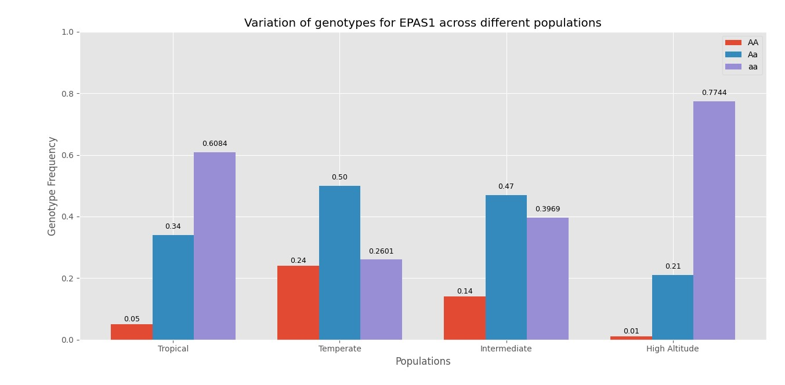
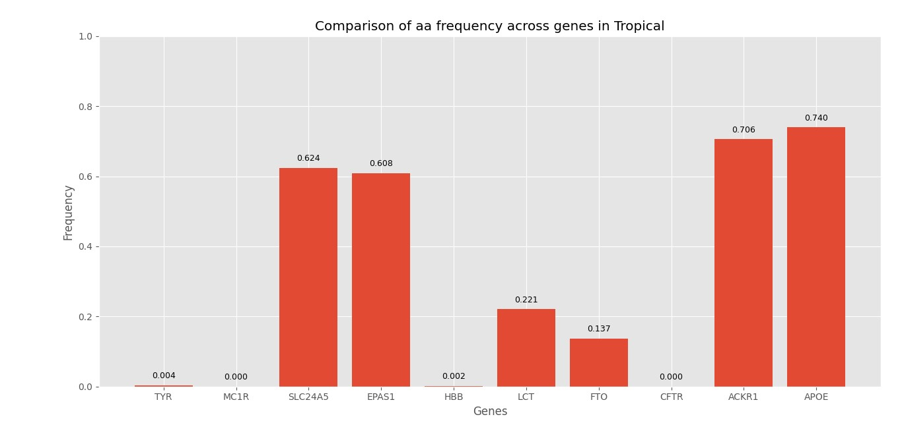
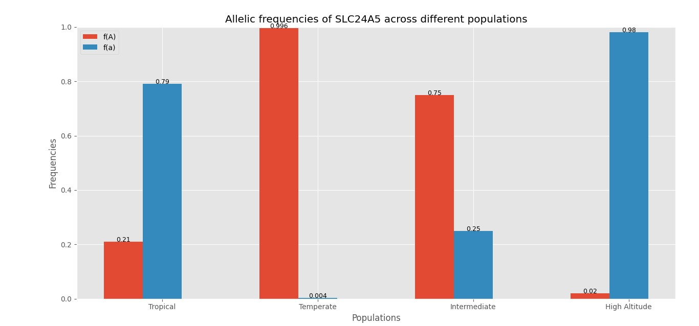

# 🚀 **Allelica**

<p align="center">
  
  
  
  
</p>

---

## 🧬 **Allelica**

Now, I know what you must be thinking —
**“Allelica? Who’s she?”**

And no, *Allelica is not a woman.*

The name comes from **allele** — alternate forms of a gene.

---

## 🧠 **Very Quick Genetics (I promise)**

Okay… but what is a gene?

A **gene** is a segment of DNA that codes for proteins.
DNA is the genetic material that stores information and passes it down generations.

Now imagine this:

* A gene is like a *chapter in a book* (say, eye colour), everyone had the same chapter
* The *slightly different versions* of that chapter? → **alleles**

And since you inherit one copy from each parent, you always have **two alleles** → this pair is your **genotype**.

---

## 👀 **Simple Example**

Let’s say:

* **B** → brown eyes (dominant)
* **b** → blue eyes (recessive)

Then:

* **BB** → brown
* **Bb** → brown (but carries blue)
* **bb** → blue

This is why two brown-eyed parents can still have a blue-eyed child.

---

## 🧬 **Tiny Note (before a biologist attacks me)**

Yes, this is simplified. Real genetics is messier. This is just enough for this project.

---

## 📐 **The Math Side of Allelica**

Allelica works on the **Hardy–Weinberg principle**.

$$
p^2 + 2pq + q^2 = 1
$$

Where:

* **p** = frequency of dominant allele
* **q** = frequency of recessive allele

And:

* **p²** → homozygous dominant
* **2pq** → heterozygous
* **q²** → homozygous recessive

---

### 📊 Example

If:

* q = 0.3 → blue allele
* p = 0.7

Then:

* q² = 0.09 → **9% blue-eyed**
* p² = 0.49 → **49% BB**
* 2pq = 0.42 → **42% carriers**

These values stay constant unless external factors interfere.

---

## 🤖 **So… what does Allelica actually do?**

She:

* Takes allele frequency data
* Calculates genotype frequencies using Hardy–Weinberg
* Compares and visualizes them across **4 populations**

---

## 🌍 **Why I made this**

This started with me thinking:

> *“Does UV or altitude affect allele frequencies?”*

Then I found real examples (like malaria resistance varying by region),
and that turned into:

👉 *let’s build something that visualizes this*

This was originally my class 12 project (very ugly version).
This is the upgraded one.

---

## 🎥 **Preview**

### 📊 Genotype Frequencies



### 📊 Genotype Comparison



### 📈 Allele Frequencies



---

## 📊 **Data Source**

All allele frequency data was sourced from:
[gnomAD (Genome Aggregation Database)](https://gnomad.broadinstitute.org/)

| Gene    | Trait               | RS Number   |
| ------- | ------------------- | ----------- |
| TYR     | Skin Pigmentation   | rs1042602   |
| MC1R    | Skin Pigmentation   | rs1805007   |
| SLC24A5 | Skin Pigmentation   | rs111310111 |
| EPAS1   | Altitude Adaptation | rs6743991   |
| HBB     | Sickle Cell Trait   | rs10768683  |
| LCT     | Lactase Persistence | rs2304371   |
| FTO     | Obesity Risk        | rs62033438  |
| CFTR    | Cystic Fibrosis     | rs113993960 |
| ACKR1   | Malaria Resistance  | rs2814778   |
| APOE    | Alzheimers Risk     | rs440446    |

---

## ⚙️ **How to Run**

Install dependencies:

```bash
pip install pandas numpy matplotlib
```

Run:

```bash
python Allelica.py
```

---

## ✨ **Features**

* 📊 Genotype frequency comparison across populations
* 🔬 Genotype comparison across genes
* 📈 Allele frequency visualization
* 📋 Console summaries with biological interpretation
* ✅ Input validation
* 💾 CSV output of results

---

## 🚀 **Future Improvements**

- 🗺️ **v1.1** — Allele frequency heatmap across all genes and populations
- 🧬 **v2.0** — BioPython integration for direct database querying 
instead of manual CSV input
- 🖤 **v3.0** — Frontend interface (Allelica deserves to look as good 
as she works)

---

## 💡 **Final Note**

I could keep talking about genetics forever.

But this project is basically that —
just with Python and graphs.
