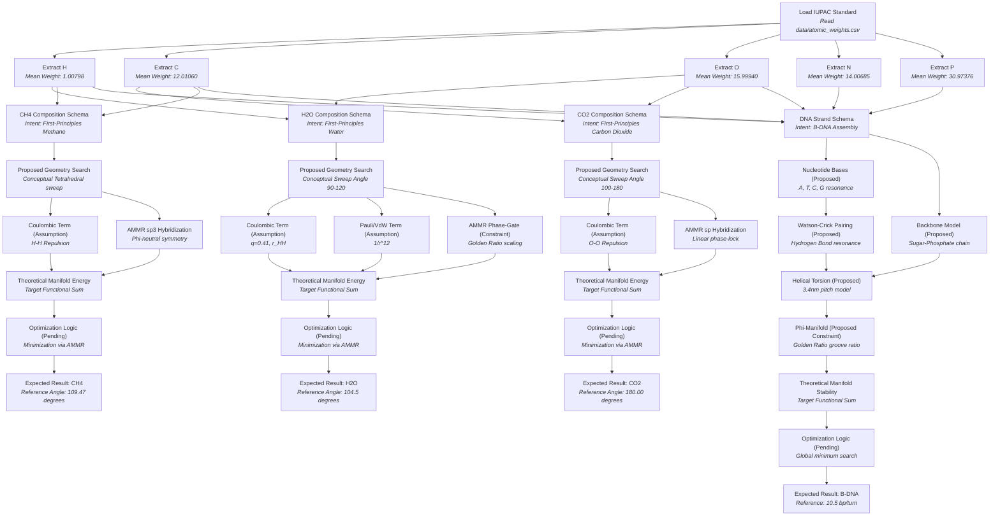

# First Principles Molecular Derivation: Architectural Intent Map

**Status:** CONCEPTUAL — This DAG maps the intended first-principles derivation path. It identifies the provenance of atomic weights and the required manifold constraints. It does NOT yet execute these calculations.

