# ENE Link Index

**Generated:** 2026-04-18
**Records:** 131
**Links:** 8515

Cross-reference index for imported ENE records. Shows relationships between
substrate packages, graph addresses, JSON manifests, and chat sessions.

---

## Entity Clusters

Records grouped by shared entities:

### Component:Substrate

**Records (25):**

- `substrate_packages_755cad3f154c4dc7...` — packages record
- `substrate_packages_745d534f84d23977...` — packages record
- `substrate_packages_fts_0190be8958a903e4...` — packages_fts record
- `substrate_packages_fts_aa9e24b4c76cde19...` — packages_fts record
- `substrate_packages_fts_data_fead6fafae18...` — packages_fts_data record
- ... and 20 more

### Date:2026-04-12

**Records (14):**

- `json_ingestion_catalog_downloads_2026-04...` — ingestion_catalog_downloads_2026-04-12 entry 0
- `json_ingestion_catalog_downloads_2026-04...` — ingestion_catalog_downloads_2026-04-12 entry 1
- `json_ingestion_catalog_downloads_2026-04...` — ingestion_catalog_downloads_2026-04-12 entry 2
- `json_ingestion_catalog_downloads_2026-04...` — ingestion_catalog_downloads_2026-04-12 entry 3
- `json_ingestion_catalog_downloads_2026-04...` — ingestion_catalog_downloads_2026-04-12 entry 4
- ... and 9 more

---

## Strong Links (strength ≥ 0.5)

### packages record ↔ packages record

- **Type:** temporal_proximity
- **Strength:** 1.00
- **Evidence:** 0.0 hours apart

### packages record ↔ packages_fts record

- **Type:** temporal_proximity
- **Strength:** 1.00
- **Evidence:** 0.0 hours apart

### packages record ↔ packages_fts record

- **Type:** temporal_proximity
- **Strength:** 1.00
- **Evidence:** 0.0 hours apart

### packages record ↔ packages_fts_data record

- **Type:** temporal_proximity
- **Strength:** 1.00
- **Evidence:** 0.0 hours apart

### packages record ↔ packages_fts_data record

- **Type:** temporal_proximity
- **Strength:** 1.00
- **Evidence:** 0.0 hours apart

### packages record ↔ packages_fts_data record

- **Type:** temporal_proximity
- **Strength:** 1.00
- **Evidence:** 0.0 hours apart

### packages record ↔ packages_fts_data record

- **Type:** temporal_proximity
- **Strength:** 1.00
- **Evidence:** 0.0 hours apart

### packages record ↔ packages_fts_data record

- **Type:** temporal_proximity
- **Strength:** 1.00
- **Evidence:** 0.0 hours apart

### packages record ↔ packages_fts_data record

- **Type:** temporal_proximity
- **Strength:** 1.00
- **Evidence:** 0.0 hours apart

### packages record ↔ packages_fts_data record

- **Type:** temporal_proximity
- **Strength:** 1.00
- **Evidence:** 0.0 hours apart

### packages record ↔ packages_fts_data record

- **Type:** temporal_proximity
- **Strength:** 1.00
- **Evidence:** 0.0 hours apart

### packages record ↔ packages_fts_idx record

- **Type:** temporal_proximity
- **Strength:** 1.00
- **Evidence:** 0.0 hours apart

### packages record ↔ packages_fts_idx record

- **Type:** temporal_proximity
- **Strength:** 1.00
- **Evidence:** 0.0 hours apart

### packages record ↔ packages_fts_idx record

- **Type:** temporal_proximity
- **Strength:** 1.00
- **Evidence:** 0.0 hours apart

### packages record ↔ packages_fts_idx record

- **Type:** temporal_proximity
- **Strength:** 1.00
- **Evidence:** 0.0 hours apart

### packages record ↔ packages_fts_idx record

- **Type:** temporal_proximity
- **Strength:** 1.00
- **Evidence:** 0.0 hours apart

### packages record ↔ packages_fts_idx record

- **Type:** temporal_proximity
- **Strength:** 1.00
- **Evidence:** 0.0 hours apart

### packages record ↔ packages_fts_docsize record

- **Type:** temporal_proximity
- **Strength:** 1.00
- **Evidence:** 0.0 hours apart

### packages record ↔ packages_fts_docsize record

- **Type:** temporal_proximity
- **Strength:** 1.00
- **Evidence:** 0.0 hours apart

### packages record ↔ packages_fts_docsize record

- **Type:** temporal_proximity
- **Strength:** 1.00
- **Evidence:** 0.0 hours apart

### packages record ↔ packages_fts_docsize record

- **Type:** temporal_proximity
- **Strength:** 1.00
- **Evidence:** 0.0 hours apart

### packages record ↔ packages_fts_docsize record

- **Type:** temporal_proximity
- **Strength:** 1.00
- **Evidence:** 0.0 hours apart

### packages record ↔ packages_fts_docsize record

- **Type:** temporal_proximity
- **Strength:** 1.00
- **Evidence:** 0.0 hours apart

### packages record ↔ packages_fts_config record

- **Type:** temporal_proximity
- **Strength:** 1.00
- **Evidence:** 0.0 hours apart

### packages record ↔ Graph OS manifold_registry manifest

- **Type:** temporal_proximity
- **Strength:** 1.00
- **Evidence:** 0.0 hours apart

### packages record ↔ ingestion_catalog_downloads_2026-04-12 e

- **Type:** temporal_proximity
- **Strength:** 1.00
- **Evidence:** 0.0 hours apart

### packages record ↔ ingestion_catalog_downloads_2026-04-12 e

- **Type:** temporal_proximity
- **Strength:** 1.00
- **Evidence:** 0.0 hours apart

### packages record ↔ ingestion_catalog_downloads_2026-04-12 e

- **Type:** temporal_proximity
- **Strength:** 1.00
- **Evidence:** 0.0 hours apart

### packages record ↔ ingestion_catalog_downloads_2026-04-12 e

- **Type:** temporal_proximity
- **Strength:** 1.00
- **Evidence:** 0.0 hours apart

### packages record ↔ ingestion_catalog_downloads_2026-04-12 e

- **Type:** temporal_proximity
- **Strength:** 1.00
- **Evidence:** 0.0 hours apart

### packages record ↔ ingestion_catalog_downloads_2026-04-12 e

- **Type:** temporal_proximity
- **Strength:** 1.00
- **Evidence:** 0.0 hours apart

### packages record ↔ ingestion_catalog_downloads_2026-04-12 e

- **Type:** temporal_proximity
- **Strength:** 1.00
- **Evidence:** 0.0 hours apart

### packages record ↔ ingestion_catalog_downloads_2026-04-12 e

- **Type:** temporal_proximity
- **Strength:** 1.00
- **Evidence:** 0.0 hours apart

### packages record ↔ ingestion_catalog_downloads_2026-04-12 e

- **Type:** temporal_proximity
- **Strength:** 1.00
- **Evidence:** 0.0 hours apart

### packages record ↔ ingestion_catalog_downloads_2026-04-12 e

- **Type:** temporal_proximity
- **Strength:** 1.00
- **Evidence:** 0.0 hours apart

### packages record ↔ ingestion_catalog_downloads_2026-04-12 e

- **Type:** temporal_proximity
- **Strength:** 1.00
- **Evidence:** 0.0 hours apart

### packages record ↔ ingestion_catalog_downloads_2026-04-12 e

- **Type:** temporal_proximity
- **Strength:** 1.00
- **Evidence:** 0.0 hours apart

### packages record ↔ ingestion_catalog_downloads_2026-04-12 e

- **Type:** temporal_proximity
- **Strength:** 1.00
- **Evidence:** 0.0 hours apart

### packages record ↔ ingestion_catalog_downloads_2026-04-12 e

- **Type:** temporal_proximity
- **Strength:** 1.00
- **Evidence:** 0.0 hours apart

### packages record ↔ event_catalog entry 0

- **Type:** temporal_proximity
- **Strength:** 1.00
- **Evidence:** 0.0 hours apart

### packages record ↔ event_catalog entry 1

- **Type:** temporal_proximity
- **Strength:** 1.00
- **Evidence:** 0.0 hours apart

### packages record ↔ event_catalog entry 2

- **Type:** temporal_proximity
- **Strength:** 1.00
- **Evidence:** 0.0 hours apart

### packages record ↔ event_catalog entry 3

- **Type:** temporal_proximity
- **Strength:** 1.00
- **Evidence:** 0.0 hours apart

### packages record ↔ event_catalog entry 4

- **Type:** temporal_proximity
- **Strength:** 1.00
- **Evidence:** 0.0 hours apart

### packages record ↔ event_catalog entry 5

- **Type:** temporal_proximity
- **Strength:** 1.00
- **Evidence:** 0.0 hours apart

### packages record ↔ event_catalog entry 6

- **Type:** temporal_proximity
- **Strength:** 1.00
- **Evidence:** 0.0 hours apart

### packages record ↔ event_catalog entry 7

- **Type:** temporal_proximity
- **Strength:** 1.00
- **Evidence:** 0.0 hours apart

### packages record ↔ event_catalog entry 8

- **Type:** temporal_proximity
- **Strength:** 1.00
- **Evidence:** 0.0 hours apart

### packages record ↔ event_catalog entry 9

- **Type:** temporal_proximity
- **Strength:** 1.00
- **Evidence:** 0.0 hours apart

### packages record ↔ event_catalog entry 10

- **Type:** temporal_proximity
- **Strength:** 1.00
- **Evidence:** 0.0 hours apart

---

## Connection Graph (DOT format)

```dot
digraph ENE_Links {
  rankdir=LR;
  node [shape=box, style=rounded];

  "substrate_packages_7" [label="packages record", fillcolor=lightblue, style="filled,rounded"];
  "substrate_packages_7" [label="packages record", fillcolor=lightblue, style="filled,rounded"];
  "substrate_packages_f" [label="packages_fts record", fillcolor=lightblue, style="filled,rounded"];
  "substrate_packages_f" [label="packages_fts record", fillcolor=lightblue, style="filled,rounded"];
  "substrate_packages_f" [label="packages_fts_data re", fillcolor=lightblue, style="filled,rounded"];
  "substrate_packages_f" [label="packages_fts_data re", fillcolor=lightblue, style="filled,rounded"];
  "substrate_packages_f" [label="packages_fts_data re", fillcolor=lightblue, style="filled,rounded"];
  "substrate_packages_f" [label="packages_fts_data re", fillcolor=lightblue, style="filled,rounded"];
  "substrate_packages_f" [label="packages_fts_data re", fillcolor=lightblue, style="filled,rounded"];
  "substrate_packages_f" [label="packages_fts_data re", fillcolor=lightblue, style="filled,rounded"];
  "substrate_packages_f" [label="packages_fts_data re", fillcolor=lightblue, style="filled,rounded"];
  "substrate_packages_f" [label="packages_fts_data re", fillcolor=lightblue, style="filled,rounded"];
  "substrate_packages_f" [label="packages_fts_idx rec", fillcolor=lightblue, style="filled,rounded"];
  "substrate_packages_f" [label="packages_fts_idx rec", fillcolor=lightblue, style="filled,rounded"];
  "substrate_packages_f" [label="packages_fts_idx rec", fillcolor=lightblue, style="filled,rounded"];
  "substrate_packages_f" [label="packages_fts_idx rec", fillcolor=lightblue, style="filled,rounded"];
  "substrate_packages_f" [label="packages_fts_idx rec", fillcolor=lightblue, style="filled,rounded"];
  "substrate_packages_f" [label="packages_fts_idx rec", fillcolor=lightblue, style="filled,rounded"];
  "substrate_packages_f" [label="packages_fts_docsize", fillcolor=lightblue, style="filled,rounded"];
  "substrate_packages_f" [label="packages_fts_docsize", fillcolor=lightblue, style="filled,rounded"];
  "substrate_packages_f" [label="packages_fts_docsize", fillcolor=lightblue, style="filled,rounded"];
  "substrate_packages_f" [label="packages_fts_docsize", fillcolor=lightblue, style="filled,rounded"];
  "substrate_packages_f" [label="packages_fts_docsize", fillcolor=lightblue, style="filled,rounded"];
  "substrate_packages_f" [label="packages_fts_docsize", fillcolor=lightblue, style="filled,rounded"];
  "substrate_packages_f" [label="packages_fts_config ", fillcolor=lightblue, style="filled,rounded"];
  "graph_manifold_regis" [label="Graph OS manifold_re", fillcolor=lightgreen, style="filled,rounded"];
  "json_ingestion_catal" [label="ingestion_catalog_do", fillcolor=lightyellow, style="filled,rounded"];
  "json_ingestion_catal" [label="ingestion_catalog_do", fillcolor=lightyellow, style="filled,rounded"];
  "json_ingestion_catal" [label="ingestion_catalog_do", fillcolor=lightyellow, style="filled,rounded"];
  "json_ingestion_catal" [label="ingestion_catalog_do", fillcolor=lightyellow, style="filled,rounded"];

  "substrate_packages_7" -> "substrate_packages_7" [label="temporal_p", penwidth=2.0];
  "substrate_packages_7" -> "substrate_packages_f" [label="temporal_p", penwidth=2.0];
  "substrate_packages_7" -> "substrate_packages_f" [label="temporal_p", penwidth=2.0];
  "substrate_packages_7" -> "substrate_packages_f" [label="temporal_p", penwidth=2.0];
  "substrate_packages_7" -> "substrate_packages_f" [label="temporal_p", penwidth=2.0];
  "substrate_packages_7" -> "substrate_packages_f" [label="temporal_p", penwidth=2.0];
  "substrate_packages_7" -> "substrate_packages_f" [label="temporal_p", penwidth=2.0];
  "substrate_packages_7" -> "substrate_packages_f" [label="temporal_p", penwidth=2.0];
  "substrate_packages_7" -> "substrate_packages_f" [label="temporal_p", penwidth=2.0];
  "substrate_packages_7" -> "substrate_packages_f" [label="temporal_p", penwidth=2.0];
  "substrate_packages_7" -> "substrate_packages_f" [label="temporal_p", penwidth=2.0];
  "substrate_packages_7" -> "substrate_packages_f" [label="temporal_p", penwidth=2.0];
  "substrate_packages_7" -> "substrate_packages_f" [label="temporal_p", penwidth=2.0];
  "substrate_packages_7" -> "substrate_packages_f" [label="temporal_p", penwidth=2.0];
  "substrate_packages_7" -> "substrate_packages_f" [label="temporal_p", penwidth=2.0];
  "substrate_packages_7" -> "substrate_packages_f" [label="temporal_p", penwidth=2.0];
  "substrate_packages_7" -> "substrate_packages_f" [label="temporal_p", penwidth=2.0];
  "substrate_packages_7" -> "substrate_packages_f" [label="temporal_p", penwidth=2.0];
  "substrate_packages_7" -> "substrate_packages_f" [label="temporal_p", penwidth=2.0];
  "substrate_packages_7" -> "substrate_packages_f" [label="temporal_p", penwidth=2.0];
  "substrate_packages_7" -> "substrate_packages_f" [label="temporal_p", penwidth=2.0];
  "substrate_packages_7" -> "substrate_packages_f" [label="temporal_p", penwidth=2.0];
  "substrate_packages_7" -> "substrate_packages_f" [label="temporal_p", penwidth=2.0];
  "substrate_packages_7" -> "substrate_packages_f" [label="temporal_p", penwidth=2.0];
  "substrate_packages_7" -> "graph_manifold_regis" [label="temporal_p", penwidth=2.0];
  "substrate_packages_7" -> "json_ingestion_catal" [label="temporal_p", penwidth=2.0];
  "substrate_packages_7" -> "json_ingestion_catal" [label="temporal_p", penwidth=2.0];
  "substrate_packages_7" -> "json_ingestion_catal" [label="temporal_p", penwidth=2.0];
  "substrate_packages_7" -> "json_ingestion_catal" [label="temporal_p", penwidth=2.0];
  "substrate_packages_7" -> "json_ingestion_catal" [label="temporal_p", penwidth=2.0];
  "substrate_packages_7" -> "json_ingestion_catal" [label="temporal_p", penwidth=2.0];
  "substrate_packages_7" -> "json_ingestion_catal" [label="temporal_p", penwidth=2.0];
  "substrate_packages_7" -> "json_ingestion_catal" [label="temporal_p", penwidth=2.0];
  "substrate_packages_7" -> "json_ingestion_catal" [label="temporal_p", penwidth=2.0];
  "substrate_packages_7" -> "json_ingestion_catal" [label="temporal_p", penwidth=2.0];
  "substrate_packages_7" -> "json_ingestion_catal" [label="temporal_p", penwidth=2.0];
  "substrate_packages_7" -> "json_ingestion_catal" [label="temporal_p", penwidth=2.0];
  "substrate_packages_7" -> "json_ingestion_catal" [label="temporal_p", penwidth=2.0];
  "substrate_packages_7" -> "json_ingestion_catal" [label="temporal_p", penwidth=2.0];
  "substrate_packages_7" -> "json_event_catalog_0" [label="temporal_p", penwidth=2.0];
}
```



---

## Query Interface

Find related records by entity:

```python
# Find all records mentioning 'warden'
related = query_by_entity('component:warden')

# Find records linked to specific chat session
linked = find_links('chat-tardygrada-patent-session-20260404')

# Temporal cluster around date
cluster = temporal_cluster('2026-04-04', hours=24)
```

---

## JSON Export

The complete link graph is available as JSON for programmatic access:

```bash
python3 tools/migrations/ene_link_index.py --json > data/ene_link_graph.json
```

