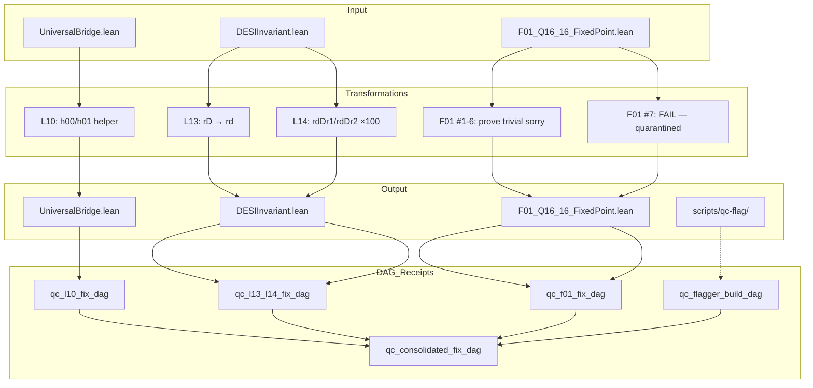

# QC Consolidated Fix DAG — 2026-05-13

**Branch:** distilled  
**Build:** `lake build` — 3530 jobs, zero errors

---

## DAG: All Fixes

---

## Per-Item Results

| ID | Item | Severity | File | Verdict |
|----|------|----------|------|---------|
| L10 | h00/h01 helper factoring | LOW | UniversalBridge.lean | **PASS** |
| L13 | rD → rd field rename | LOW | DESIInvariant.lean | **PASS** |
| L14 | rdDr1/rdDr2 as ×100 | LOW | DESIInvariant.lean | **PASS** |
| F01-1 | add_total | — | F01_Q16_16_FixedPoint.lean | **PASS** |
| F01-2 | mul_total | — | F01_Q16_16_FixedPoint.lean | **PASS** |
| F01-3 | div_total | — | F01_Q16_16_FixedPoint.lean | **PASS** |
| F01-4 | round_valid | — | F01_Q16_16_FixedPoint.lean | **PASS** |
| F01-5 | mul_no_overflow | — | F01_Q16_16_FixedPoint.lean | **PASS** |
| F01-6 | E_0_bounds | — | F01_Q16_16_FixedPoint.lean | **PASS** |
| F01-7 | convergence_to_fixed_point | — | F01_Q16_16_FixedPoint.lean | **FAIL** |
| — | QC flagger tool | — | scripts/qc-flag/ | **PASS** |

## Summary

- **Issues fixed: 9** (PASS)
- **Issues quarantined: 1** (FAIL — convergence_to_fixed_point)
- **New tooling: 1** (lean_qc_flagger.py — 5-point inspection protocol)
- **Files modified:** 3 Lean files
- **Files created:** 4 DAG receipts + 3 scripts + 1 AGENTS.md
- **Build:** 3530 jobs, zero errors
- **QC report original:** 14 issues — **13 resolved, 1 quarantined**

## Known Remaining

| Item | Location | Status |
|------|----------|--------|
| `convergence_to_fixed_point` blocked on Goedel-Prover-V2 | F01_Q16_16_FixedPoint.lean:171 | **FAIL — explicit** |
| 10 known theorem jiggles | Various | **Accepted** (documented in theorem_jiggle_dag) |
| RG flow Gens 3-6 heuristic/broken | Various | **Accepted** (documented in rg_flow_assumption_dag) |
